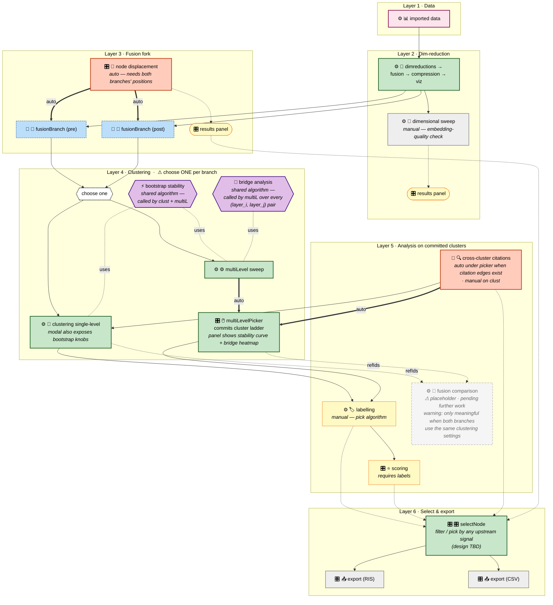

# Workflow card palette

> This diagram is a **palette of card choices at each layer** — not a representation of a single workflow instance. A real workflow picks one path through it (e.g. `clust` OR `multiL`, never both in the same branch).

## Interaction markers

Each card is prefixed with a marker for how the user interacts with it:

| Marker | Meaning |
|---|---|
| ⚙ | **modal** — gear-click opens a config modal; user picks params before running |
| 🎛 | **panel** — no modal, but produces an interactive results panel the user drives |
| 🚀 | **run-only** — no modal, no interactive panel; fires and produces a passive result |

Shared *algorithms* (called by cards, not cards themselves) use a hexagon shape.



## Edge legend

| Symbol | Meaning |
|---|---|
| `-->` solid arrow | manual "+" add — user chooses to add this card |
| `== auto ==>` thick arrow | auto-spawned when the parent's job completes |
| `-.->` dotted arrow | feeds a results panel or downstream UI (not a parent edge) |
| `-.uses.-` undirected dotted | algorithm called by a card (not a parent edge, not data flow) |
| `-.refIds.->` dotted with label | DAG fan-in reference (card consumes results from multiple upstreams) |
| `{{ choose one }}` diamond gate | mutually-exclusive choice within a branch |

## Class legend

| Class | Shape | Role |
|---|---|---|
| 🟪 **root** | rect | single entry point |
| 🟩 **pipeline** | rect | data-processing spine |
| 🟦 **router** | dashed rect | no-modal fork node (pre/post-fusion branches) |
| 🟧 **autoFire** | rect | computed automatically, no card-level config |
| 🟨 **chain** | rect / stadium | sequential analysis or results panel |
| ⬜ **leaf** | rect | terminal output |
| ⬜ **gate** | hex | mutually-exclusive choice |
| ⬜ **placeholder** | dashed rect | card slot reserved; logic is stub-only |
| 🟣 **algo** | hex | shared algorithm called by cards (not a card itself) |

## Picker panel layout

The multiLevelPicker's panel is now a multi-signal informer. The user picks layers with both **stability** (already there) and **bridge density** (new) visible at the same time:

```
┌─────────────────────────────────── Picker panel ────────────────────────────────────┐
│  ┌─────────────────────────┐  ┌──────────────────────────────────────────────────┐ │
│  │ Stability curve  (LEFT) │  │  Bridge heatmap  (RIGHT)                         │ │
│  │ y = bootstrap stability │  │   x = parent layer (coarser)                     │ │
│  │ x = granularity         │  │   y = child  layer (finer)                       │ │
│  │ + clickable dots        │  │   cell = bridge count, raw in tile,              │ │
│  │   for each level        │  │          normalised colour                       │ │
│  │   click ↔ heatmap       │  │   click cell highlights both layers on curve     │ │
│  └─────────────────────────┘  └──────────────────────────────────────────────────┘ │
│                                                                                      │
│  ┌──────────────────────────── Live readout (BOTTOM) ───────────────────────────┐  │
│  │  Selected layers: [L0: 142 clusters] → [L4: 38] → [L9: 12]                   │  │
│  │  Bridges (adjacent picks):    L4 vs L0: 27       L9 vs L4: 8                 │  │
│  └────────────────────────────────────────────────────────────────────────────────┘  │
└──────────────────────────────────────────────────────────────────────────────────────┘
```

Heatmap and stability curve are bound: clicking a heatmap cell highlights both layers on the curve; clicking a stability point shades the matching heatmap row/column. The readout updates live as the user picks (no recompute — filters from pre-computed `bridgesPerPair`).

## Semantics notes

- **`bootstrap` is no longer a card.** It's a shared algorithm called by both `clust` (single-level) and `multiL` (per-granularity). Its knobs (iteration count `B`, etc.) move into the clustering modal as a bootstrap section.
- **`bridge` is no longer a card.** Bridges are computed over every (`layer_i`, `layer_j`) pair during the multiLevel sweep and rendered as a heatmap in the picker panel. The result is stored on the multiLevel producer (`multiLevel.result.bridgesPerPair`); the picker reads from there.
- **`nodeDisp` is one instance taking both fusion branches as inputs** — not one per branch. Conceptually part of the fork; auto-fires as soon as both branch positions exist.
- **`crossCite` auto-fires under `picker`** when the ladder commits, **gated on `state.rawCitationEdges` being non-empty** (toy data without synthetic citations skips the auto-spawn rather than creating a perma-failed card). Still available as a manual "+" option on `clust` (single-level) and `picker` (for toy data with manually-generated edges).
- **`label` is the only manual card downstream of clustering** — the user picks the labelling algorithm. `scoring` depends on labels.
- **`dimSweep` stays on `dimred` only** — embedding-quality check, separate from cluster-quality (which is what bootstrap measures).
- **`fusionComparison` is a placeholder** — the card and its full runner are still in place (so a user with matching clustering settings can get value), but a ⚠ warning banner sits above every modal + panel render and on its next-steps hints to flag that this is pending further work. Only meaningful when both clusterings used the same algorithm + parameters.
- **`selectNode` is deferred** — a filter/picker UI that aggregates upstream signals (labels, scores, citation degree, displacement). Design TBD.

## Out of scope for this palette

The following card types exist in code but are **not user-creatable in the new flow**:

- `citationLayout` — was useful during app development; superseded by selectNode-driven export.
- `citations`, `alignment`, `blend` — toy-graph chain. Code stays pinned for future work; not exposed here.

These remain in the codebase untouched and are not shown on the diagram to keep it focused on the live, user-driven flow.
